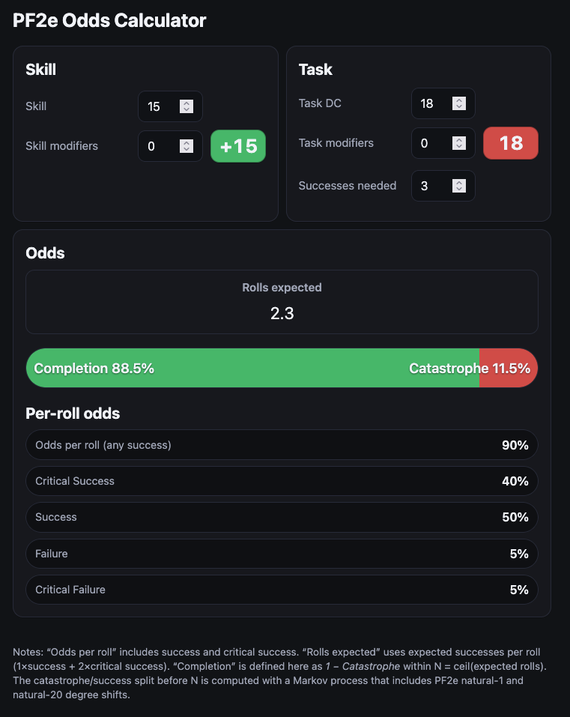

# PF2e / SF2e Odds Calculator

A single-page web app for calculating probabilities in **Pathfinder 2e** and **Starfinder 2e** skill challenges.

<!-- Add docs/screenshot.png later if you like -->
<!--  -->

## Features

- Inputs: **Task DC**, **Task modifiers**, **Skill**, **Skill modifiers**, **Successes needed**.
- Outputs:
  - **DC** and **Skill Bonus** badges (colour-coded).
  - Per-roll odds: **Critical Success**, **Success**, **Failure**, **Critical Failure**, and **Any success**.
  - **Expected rolls** (fractional, 1 dp).
  - **Completion** vs **Catastrophe** with a split bar.
 - Exact PF2e/SF2e degree shifts (**nat 1** downgrade, **nat 20** upgrade).
- **Markov** model to compute catastrophe vs completion within *ceil(expected rolls)*.
- Responsive dark theme; mobile-friendly; no dependencies.

## Usage

1. Open [`index.html`](index.html) in a modern browser.
2. Enter **Task** and **Skill** values; set **Successes needed**.
3. Results update when you tab out of a field.

## Development

- Pure **HTML/CSS/JavaScript**; no build step.
- Script is wrapped in `DOMContentLoaded` to avoid globals.

## Folder structure

```text
pf2e-odds/
├─ index.html        # main app
├─ README.md         # this file
└─ docs/             # optional assets
   └─ screenshot.png (optional)
```

## License

[MIT](LICENSE)